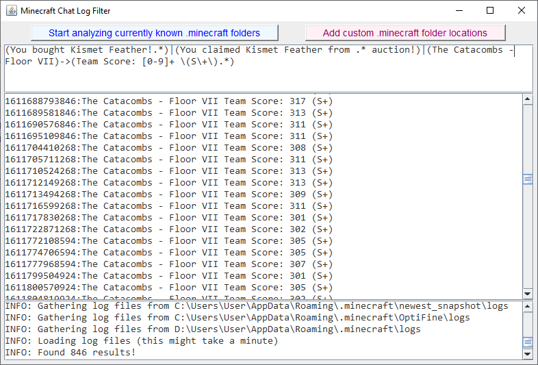

# Minecraft Chat Log Filter
A Java tool to filter the chat messages logged in all Minecraft log files available using a specialized regex syntax and the simple press of a button

The syntax in the core is a simple RegEx syntax with a speciallities so that it all works together with the concept of multiple chat log lines. Here are the main features:
- `(regex)` - filters all lines that match the provided regex
- `(regex1)|(regex2)` - filters all lines that match either one of the two provided regex
- `(regex1)->(regex2)` - filters all lines that match the first regex and the second regex matches one of the followup lines

These three can be combined to one big regex. One example for this would be a regex to filter all lines that either indicate the gaining of a 'Kismet Feather' or the successful S+ completion of a Floor 7 run (Hypixel SkyBlock example):

`(You bought Kismet Feather!.*)|(You claimed Kismet Feather from .* auction!)|(The Catacombs - Floor VII)->(Team Score: [0-9]+ \(S\+\).*)`

